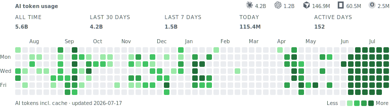

# Hi, I'm Rahul

I build AI agents for a living. At this point they do most of my typing, and I have the receipts:

<picture>
  <source media="(prefers-color-scheme: dark)" srcset="assets/ai-usage-dark.svg">
  
</picture>

That's my real token usage across Claude Code, Codex, Cursor and friends, straight off my
machines. Made with [ai-usage-heatmap](https://github.com/rnaidu-parallel/ai-usage-heatmap),
which is open source, so you can put one on your profile too:

```sh
npx ai-usage-heatmap render
```

Also on [npm](https://www.npmjs.com/package/ai-usage-heatmap).
